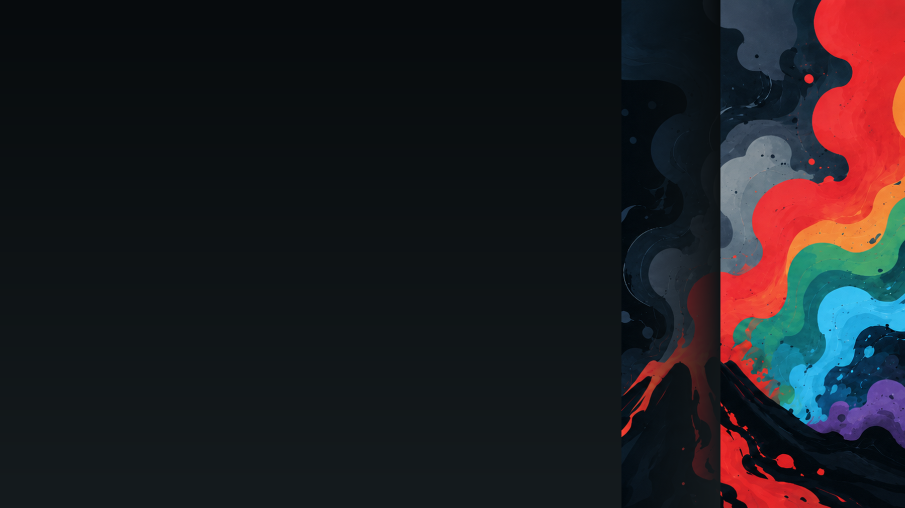

# Vulkanite for Omarchy

A dark [Omarchy](https://omarchy.org) theme built from the [Vulkanite](https://github.com/kyerpotts/vulkanite.nvim) palette.



## Install

```bash
omarchy theme install https://github.com/kyerpotts/omarchy-vulkanite-theme.git
```

The theme applies Vulkanite across Omarchy-generated terminal, shell, launcher, lock-screen, TUI, and editor configurations. Its Omarchy 4 treatment adds compact glass surfaces, cyan-to-teal Hyprland borders, tuned blur and spacing, and six volcanic backgrounds. LazyVim uses the original `vulkanite.nvim` colorscheme.

## Palette

- Background: `#0f1416`
- Foreground: `#dce5e9`
- Accent: `#8fe0fa`
- Red: `#e05f64`
- Yellow: `#e0af68`
- Green: `#8be086`
- Cyan: `#4fa3a6`
- Blue: `#76c7e3`
- Magenta: `#9083b9`

## License

MIT © Kyer Potts
